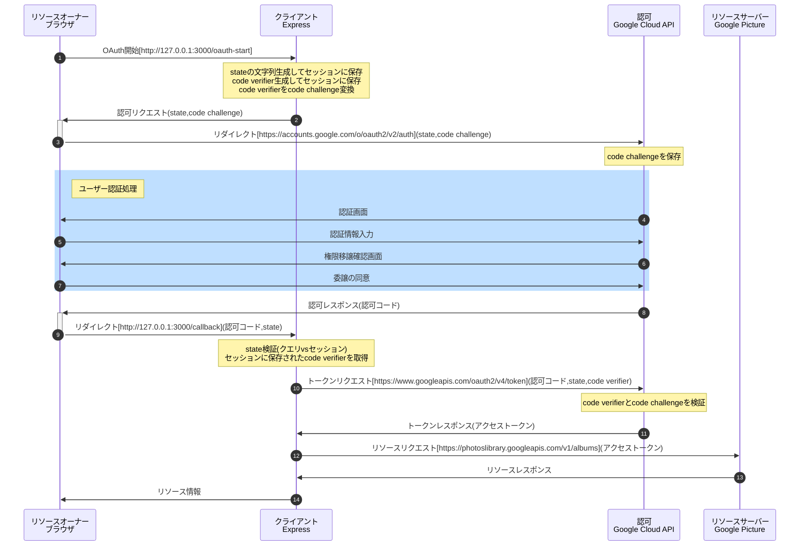

# 「雰囲気で OAuth2.0 を使っているエンジニアが OAuth2.0 を整理して、手を動かしながら学べる本」のチュートリアルを Express で実装

## Set Up

1. 下記コマンドを実行

```
npm install nodemon
npm install
```

2. google cloud console からクライアントを設定  
   https://console.cloud.google.com/
3. config.js に google cloud API から取得した clientId と clientSecret を設定する。

## 起動

1. 下記コマンドを実行

```
start authorization code
```

2. ブラウザから下記 URL に接続  
   http://127.0.0.1:3000/oauth-start

## OAuth の認可コードフロー + PKCE のシーケンス図



## 参考ブログ

1. エクスプレスでセッションの利用  
   https://qiita.com/yuta-katayama-23/items/020169b66d1abe242b37#const-state--generatorsstate
2. PKCE の code_challenge と code_challenge の生成  
   https://yaasita.github.io/2019/04/29/pkce/
3. Express は localhost と 127.0.0.1 を別ドメインとして扱う  
   https://stackoverflow.com/questions/55825921/nodejs-sessionid-is-changing-after-redirect-how-to-keep-user-session-data-per
4. 雰囲気で OAuth2.0 を使っているエンジニアが OAuth2.0 を整理して、手を動かしながら学べる本」  
   https://authya.booth.pm/items/1550861
5. Marmaid 起動(シーケンス図)  
   https://mermaid.js.org/syntax/sequenceDiagram.html
