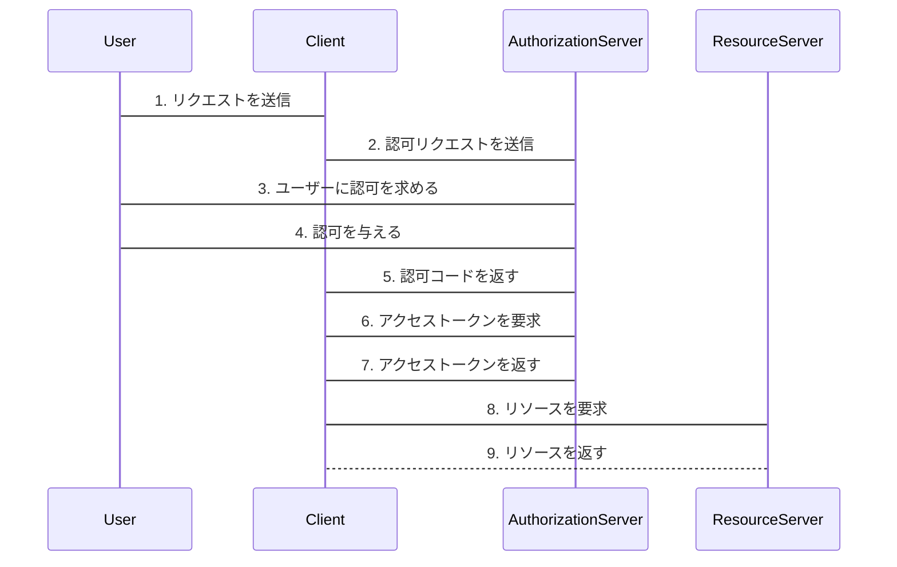

# 「雰囲気で OAuth2.0 を使っているエンジニアが OAuth2.0 を整理して、手を動かしながら学べる本」のチュートリアルを Express で実装

### 「雰囲気で OAuth2.0 を使っているエンジニアが OAuth2.0 を整理して、手を動かしながら学べる本」

https://authya.booth.pm/items/1550861

### google cloud console

https://console.cloud.google.com/

### express は localhost と 127.0.0.1 を別ドメインとして扱う

https://stackoverflow.com/questions/55825921/nodejs-sessionid-is-changing-after-redirect-how-to-keep-user-session-data-per

### 参考

https://qiita.com/yuta-katayama-23/items/020169b66d1abe242b37#const-state--generatorsstate

https://yaasita.github.io/2019/04/29/pkce/

### OAuth の認可コードフローのシーケンス図

